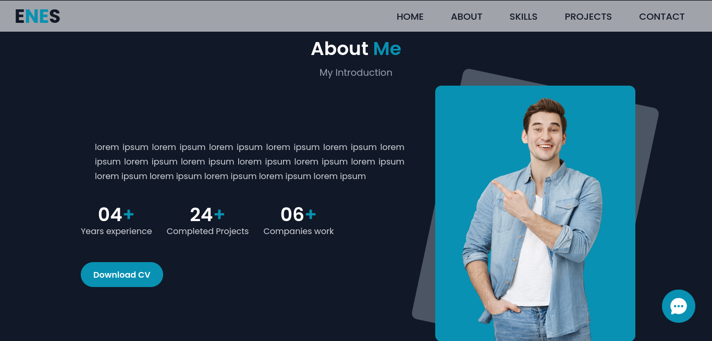
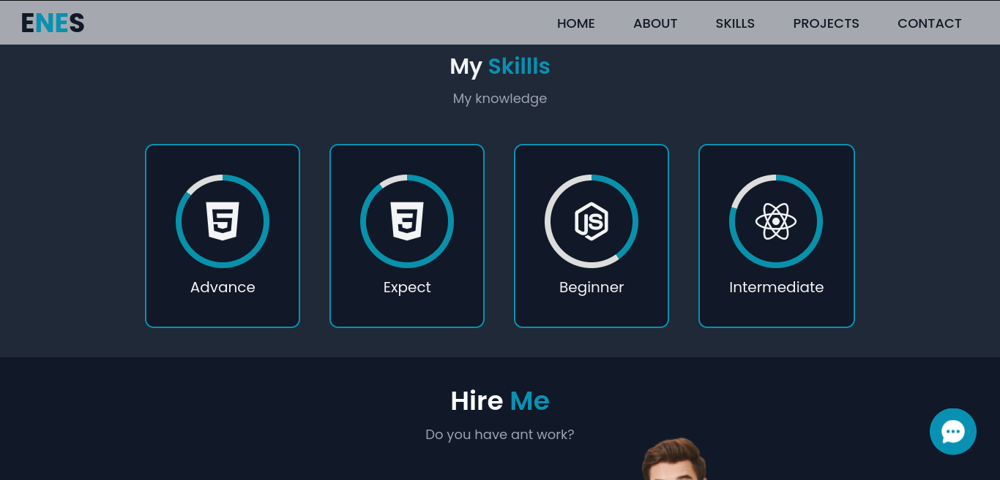
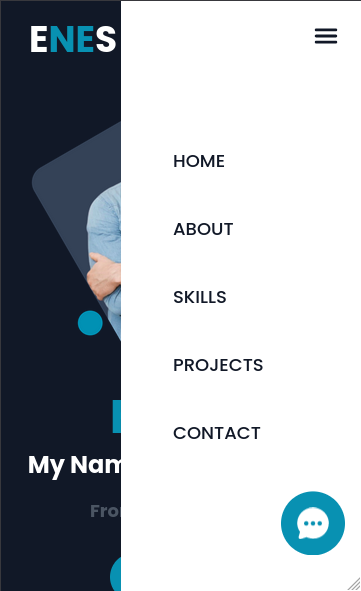

  
<h3 align="center">React Country Info</h3>

## About The Project

### Netlify Link :  [https://enes-blog-site.netlify.app/](https://enes-blog-site.netlify.app/)

![Blog Site Preview][product-screenshot]

### Built With

* React

* Javascript

* Tailwindcss

* Ionicons

* Swiper

* Webstorm

  

  ## Api 

  -

  

  ### Contact

  ### Enes Demirci

- [🐦 twitter](https://twitter.com/enesdmc00) 
  
- [ ✉️ enesdmc1907@gmail.com]()
  
- Linkedin : [https://www.linkedin.com/in/enesdemirci1](https://www.linkedin.com/in/enesdemirci1)

- Project Link: [https://github.com/enesdmc0/react-country-info](https://github.com/enesdmc0/react-tailwind-blog-site)

  

  
[product-screenshot]: images/img1.png
  

